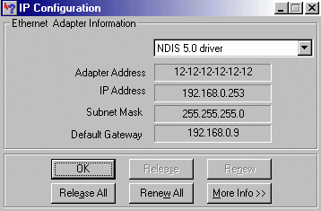



## Mac adress hacker

### Description

This document here will teach you how you can change your net adapter mac adress !
 
### More Info
 

             |
---                |---
**Submitted On**   |2003-10-18 06:18:38
**By**             |[kegham](https://github.com/Planet-Source-Code/PSCIndex/blob/master/ByAuthor/kegham.md)
**Level**          |Advanced
**User Rating**    |3.7 (11 globes from 3 users)
**Compatibility**  |VB 5\.0, VB 6\.0
**Category**       |[Miscellaneous](https://github.com/Planet-Source-Code/PSCIndex/blob/master/ByCategory/miscellaneous__1-1.md)
**World**          |[Visual Basic](https://github.com/Planet-Source-Code/PSCIndex/blob/master/ByWorld/visual-basic.md)
**Archive File**   |[Mac\_adress16605010182003\.zip](https://github.com/Planet-Source-Code/kegham-mac-adress-hacker__1-49322/archive/master.zip)

### Source Code

I dont know if this is something related with vb or developing or any source code, but you are free to read it, and i wrote it in the reason of sometimes you may ask this question to urself and no answer will find, exactly like me several times i try to find an answer but after many retries i think i find the solution, and i like you also to test it and comment on it if you find it usefull ...

